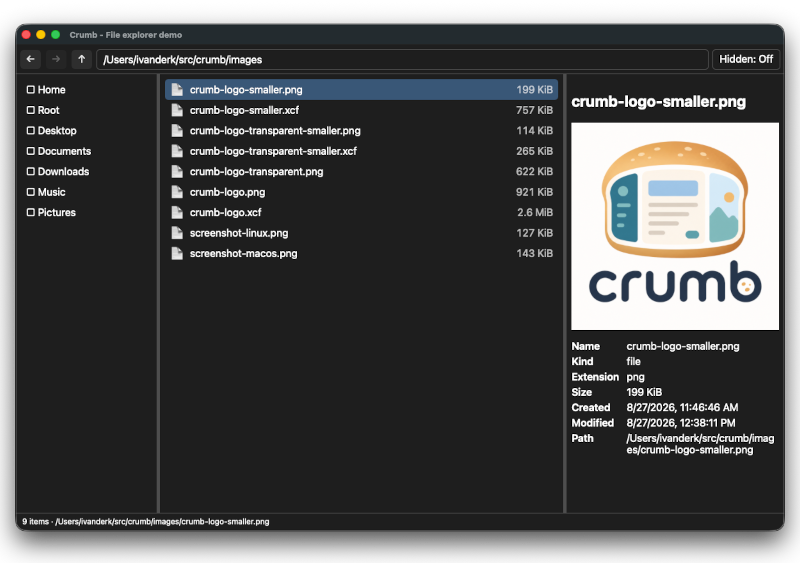
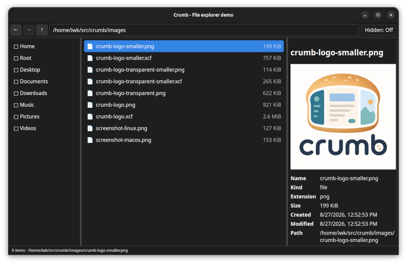

<div align="center">
  

  <p>The template, toolchain, and documentation for shipping a server-less web app as a desktop app.<br>Bun, TypeScript, and native operating-system WebViews. One window, one executable, no Chromium.</p>
  <p>
    
    
    
    
    
    
    
  </p>
</div>

Crumb is a template you clone. It gives you a native window, an embedded offline document, a narrow validated bridge between your page and a Bun host, and a build that compiles all of it into one self-contained executable per platform.

If you can build your app as a web page that needs no server, Crumb turns it into a desktop application — without shipping Chromium, without starting a local web server, and without asking anyone to install Bun or Node.js beside the finished binary.

The three-pane file browser in the screenshots below is **not** Crumb. It is `file-explorer`, the example application that proves the template works. It is the first thing you delete.

Crumb is built on [Bun](https://bun.com/) and is, in passing, a practical exploration of Bun as an application toolchain: package management, direct TypeScript execution, browser bundling, automated testing, Node-API compatibility, and compilation into standalone executables.

> [!IMPORTANT]
> Linux x64 on native Wayland and macOS arm64 are verified. X11 and XWayland are not supported. The executables Crumb produces are currently unsigned and are not packaged as installers or macOS `.app` bundles.

## What Crumb gives you

- One resizable native window using the operating system's own WebView — no bundled Chromium
- Your HTML, CSS, and JavaScript embedded in the executable, loaded without a local server, a network request, or a lookup in the source tree
- A narrow bridge between page and host: only the operations your app declares are reachable, each validated at runtime and each returning a serializable result or a normalized error
- A restrictive Content Security Policy by default, blocking remote connections, frames, object embedding, forms, and unintended navigation
- A two-stage build that bundles the UI into a single artifact and compiles it, your host code, and the Bun runtime into one self-contained executable per target
- An executable that runs from an empty directory with no Bun, Node.js, npm, source tree, or adjacent application files
- No telemetry, settings database, or persistent application state of any kind

## The file-explorer example

The example application shipped in this repository is a view-only three-pane file browser. It exists to prove the template end to end and to give you working code to read. **Delete it when you start your own app** — none of it is part of what Crumb promises.

- Three-pane layout for locations, directory contents, and previews
- Home, root, common folders, and mounted-location discovery
- Back, Forward, parent-directory, and sidebar navigation
- Hidden-file toggle with clear on/off state
- Natural, case-insensitive sorting with directories first
- Text, image, directory, and generic metadata previews
- Symlink and broken-link information
- Light and dark appearance
- Keyboard navigation and accessible pane separators
- Recoverable handling of missing files, removed volumes, and permission errors
- No file creation, editing, deletion, renaming, moving, or shell execution

That last point is the example's own choice, not a limit Crumb imposes. `file-explorer` restricts itself to inspection and bounded reads because that keeps a file browser simple and auditable, and `bun run verify:readonly` enforces it. An app you build on Crumb may read and write freely.

<figure>
  
  <figcaption>The <code>file-explorer</code> example on macOS</figcaption>
</figure>

<figure>
  
  <figcaption>The <code>file-explorer</code> example on Linux</figcaption>
</figure>

## Quick start

### Requirements

- [Bun](https://bun.com/) 1.4 or newer
- A supported native WebView stack
- Apple Silicon with macOS 13 or newer, or Ubuntu 26.04 x64 with a native Wayland session

Install dependencies and launch the `file-explorer` example:

```sh
bun install
bun run dev
```

That window is the example, not a starting point you have to keep. To build your own app, replace `src/app/` with your own page and handlers, then declare the operations your page may call in `app.config.ts`. Everything else — the window, the embedded document, the validated bridge, the build — stays as it is.

## Bun in this project

[Bun](https://bun.com/) is more than the runtime your app happens to sit on — it is the whole toolchain Crumb is built from. Every stage below is Bun doing a job that would otherwise need a separate tool:

| Bun feature | How the toolchain uses it |
| --- | --- |
| Package manager | `bun install` installs the pinned JavaScript dependencies from `bun.lock` |
| TypeScript runtime | Development and build scripts run directly from `.ts` files |
| Bundler | `Bun.build()` bundles the browser UI into one embedded HTML artifact |
| Executable compiler | `Bun.build({ compile: ... })` produces a standalone host executable containing Bun, the UI, and your application code |
| Test runner | `bun test` runs the template's platform and validation tests alongside the example's filesystem, preview, and state tests |
| Web and runtime APIs | `fetch`, `Bun.file`, `Bun.write`, and `Bun.CryptoHasher` download, store, and verify native source |
| Process API | `Bun.spawn` runs `tar`, `patch`, and Cargo while preserving their exit status |
| Node-API compatibility | The Bun host loads the compiled native WebView addon directly |

### How Bun applies the native Wayland patch

Both Linux entry paths call the same `buildNativeAddon()` function:

```text
bun run dev
└── scripts/dev.ts
    └── buildNativeAddon()

bun run build --target=linux-x64
└── scripts/build.ts
    └── buildNativeAddon()
```

On a clean clone, `.build/` is absent because it is ignored by Git. Bun therefore performs this sequence:

1. Download the source archive for one pinned `@nativewindow/webview` commit.
2. Calculate its SHA-256 digest with `Bun.CryptoHasher`.
3. Stop if the digest does not match the value pinned in [`scripts/build-native.ts`](./scripts/build-native.ts).
4. Extract a fresh source tree.
5. Apply [`native/nativewindow-webview-v1.0.6-wayland.patch`](./native/nativewindow-webview-v1.0.6-wayland.patch) using `patch --fuzz=0`.
6. Run `cargo build --release --locked`.
7. Store the resulting Node-API addon in `.build/`.
8. Load that addon for development or embed it in the standalone Linux executable.

Any download, checksum, patch, or compilation failure stops the command. The build does not fall back to the unpatched published Linux addon.

The generated addon is cached after a successful build. If `.build/nativewindow-webview-v1.0.6/native-window.linux-x64-gnu.node` already exists, the current script trusts it and skips rebuilding. A normal Git clone cannot inherit that file, but a copied working directory can. Remove the generated addon before running `bun run build:native` when you need to force a clean native rebuild.

## macOS setup

Crumb supports Apple Silicon (`arm64`) on macOS 13 or newer and uses the WKWebView included with macOS. No separate WebView runtime, Rust toolchain, C compiler, Xcode, or Homebrew package is needed for ordinary development or release builds. The verified host is macOS 26.5.2 arm64 with Bun 1.4.0; the generated executable declares macOS 13.0 as its minimum deployment version.

Confirm the machine and runtime before installing dependencies:

```sh
uname -m
sw_vers -productVersion
bun --version
```

`uname -m` must print `arm64`. Then install the pinned packages and launch the development build:

```sh
bun install
bun run dev
```

Development loads the prebuilt `@nativewindow/webview-darwin-arm64` binding from `node_modules`; the Linux-only native patch and GTK packages are not involved. Close the window to stop the development process.

The `file-explorer` example discovers Home, existing common directories, root, and accessible children of `/Volumes`. macOS may restrict Desktop, Documents, Downloads, removable volumes, or other protected locations. The example reports those failures without requesting elevated privileges. If access is desired, grant it to the terminal application used to launch it under **System Settings → Privacy & Security → Files and Folders** (or Full Disk Access only when intentionally required).

## Linux setup

The initial supported Linux distribution is Ubuntu 26.04 x64 with GTK 3, WebKitGTK 4.1, and native Wayland. Other distributions may work when they provide equivalent libraries, but are not part of the verified support matrix.

Install the runtime and build dependencies on Ubuntu:

```sh
sudo apt install \
  build-essential \
  cargo \
  libgtk-3-dev \
  libjavascriptcoregtk-4.1-0 \
  libwebkit2gtk-4.1-dev \
  patch \
  pkg-config \
  rustc
```

Crumb forces `GDK_BACKEND=wayland` internally. It will not fall back to X11 or XWayland. Distribution GTK and WebKitGTK packages may still contain dormant links to X11 compatibility libraries; those links are not used as Crumb's display backend.

## Build standalone executables

Release artifacts must currently be built on their target operating system.

### Linux x64

```sh
bun run build --target=linux-x64
./dist/crumb-linux-x64
```

### macOS arm64

```sh
bun run build --target=macos-arm64
file dist/crumb-macos-arm64
otool -L dist/crumb-macos-arm64
./dist/crumb-macos-arm64
```

The expected `file` result is a 64-bit arm64 Mach-O executable. `otool -L` must list only macOS system libraries; the embedded native addon uses the system WebKit, AppKit, and related Apple frameworks. `otool` is a release-inspection tool supplied by Apple Command Line Tools (`xcode-select --install`), but those tools are not required merely to build or run Crumb.

To verify that no application files are required beside the executable:

```sh
CRUMB_CHECK_DIR="$(mktemp -d)"
cp dist/crumb-macos-arm64 "$CRUMB_CHECK_DIR/"
cd "$CRUMB_CHECK_DIR"
./crumb-macos-arm64
```

The relocated executable has been verified from an otherwise empty directory without Bun, Node.js, npm, the repository, or network access in its runtime path. It is approximately 62 MiB because it embeds Bun, the host, the UI, and the native binding.

The raw executable is linker-signed ad hoc, not signed with an Apple Developer ID, and not notarized. A locally built executable runs normally. If a downloaded copy is quarantined, the safest option is to build it from source; otherwise, verify its provenance and use **System Settings → Privacy & Security → Open Anyway** if macOS offers that control. Never run it with `sudo`.

The resulting executable contains the Bun runtime, host code, browser UI, CSS, and application-owned assets. It does not require Bun, Node.js, the source tree, or adjacent application files at runtime. Native system WebView libraries remain operating-system dependencies.

## Using the file-explorer example

These instructions describe the example application, not the template.

- Select a location in the left pane to open it.
- Select a directory entry once to preview it.
- Double-click a directory, or select it and press Enter, to open it.
- Press Escape to clear the current selection.
- Use the **Hidden: On/Off** button to show or hide dotfiles.
- Drag either separator to resize its adjacent panes. Focused separators also respond to the arrow keys.

### Keyboard shortcuts

| Action | Linux | macOS |
| --- | --- | --- |
| Move through entries | `Up` / `Down` | `Up` / `Down` |
| First or last entry | `Home` / `End` | `Home` / `End` |
| Open selected directory | `Enter` | `Enter` |
| Clear selection | `Escape` | `Escape` |
| Parent directory | `Ctrl` + `Up` | `Command` + `Up` |
| Back | `Ctrl` + `[` | `Command` + `[` |
| Forward | `Ctrl` + `]` | `Command` + `]` |
| Toggle hidden files | `Ctrl` + `Shift` + `.` | `Command` + `Shift` + `.` |

## Preview behavior in the example

The example treats names, paths, metadata, and file contents as untrusted data.

| Content | Behavior |
| --- | --- |
| Directories | Shows metadata and a bounded direct-child count; never calculates recursive size |
| Text | Reads at most 1 MiB and renders it as inert text |
| Unknown files | Samples at most 8 KiB to distinguish text from binary content |
| PNG, JPEG, GIF, WebP | Validates the file signature and previews files up to 25 MiB |
| SVG, HTML, JavaScript | Never executes content; SVG receives a generic metadata preview |
| Unsupported files | Shows available metadata without interpreting the complete file |

Directory listings contain at most 50,000 entries and never recurse automatically.

## Architecture

Every Crumb application has two layers — the template supplies the outer three rows, your code supplies the handlers:

```text
Native window and WebView
└── Embedded HTML, CSS, and browser TypeScript
    └── Validated JSON RPC
        └── Bun host
            ├── Location discovery
            ├── Directory inspection
            ├── Bounded preview generation
            └── Native window lifecycle
```

The WebView can call only the operations declared in `app.config.ts` — nothing else is reachable, and every input is validated before a handler runs. An operation absent from that table has no route to a handler. There is no generic filesystem binding and no eval-style bridge. The embedded document also uses a restrictive Content Security Policy that blocks external connections, frames, objects, forms, and unintended scripts.

The `file-explorer` example declares four:

- `getPlatformInfo`
- `getLocations`
- `listDirectory`
- `getPreview`

All four are read-only, and `bun run verify:readonly` statically checks `src/app/` for mutation, whole-file generic reads, and shell execution. That check belongs to the example. Your application declares its own operations in `app.config.ts` and is not bound by it.

### Native Wayland patch

The published `@nativewindow/webview` 1.0.6 Linux addon attaches WebKitGTK to Tao's already-occupied top-level GTK window, producing a gray window. Crumb builds a checksum-pinned minimal fork that attaches the WebView to Tao's default content box instead.

The patch is stored at [`native/nativewindow-webview-v1.0.6-wayland.patch`](./native/nativewindow-webview-v1.0.6-wayland.patch). The build verifies the pinned upstream archive before applying the patch with zero fuzz.

## Development commands

| Command | Purpose |
| --- | --- |
| `bun run dev` | Build the embedded UI and launch the configured application |
| `bun run build:native` | Build the patched Linux native addon |
| `bun run build:ui` | Build `dist/ui.html` |
| `bun run build --target=linux-x64` | Build the Linux standalone executable |
| `bun run build --target=macos-arm64` | Build the macOS standalone executable |
| `bun test` | Run the automated test suite |
| `bun run typecheck` | Run strict TypeScript checks |
| `bun run verify:performance` | Run bounded host and native 5,000-row UI performance checks |
| `bun run verify:readonly` | Verify the production read-only boundary |

## Project structure

```text
src/kit/       The template: window bootstrap, RPC router and browser bridge,
               validation primitives, platform detection, transport types
src/app/       The file-explorer example. This is the directory you replace.
app.config.ts  Window, document policy, build targets, declared operations
main.ts        Entry point: hands the configuration to the kit
scripts/       Development, native, UI, and release build scripts
native/        Minimal pinned native binding patch
test/kit/      Template tests: platform, validation, RPC surface
test/app/      Example tests: filesystem, preview, state, boundary
docs/          Build, runtime, and feasibility notes
openspec/      Change proposals, design, requirements, and task tracking
images/        Crumb artwork
```

Nothing under `src/kit/` imports from `src/app/`, and the kit names no operation. Moving `src/app/` aside leaves the kit typechecking cleanly — that is a test, not an aspiration.

## Verification

Run the complete local checks:

```sh
bun test
bun run typecheck
bun run verify:performance
bun run verify:readonly
```

The current suite contains 36 automated tests covering filesystem behavior, validation, previews, navigation state, supported platforms, and the production capability boundary. The performance command briefly opens a native window and closes it automatically. The complete suite is verified on macOS 26.5.2 arm64 and Ubuntu 26.04 x64/Wayland; fixtures are created only below the operating system's temporary directory and are removed after each run.

## Current limitations

These apply to anything you build with Crumb:

- Windows is not supported.
- Linux requires a native Wayland session; X11 and XWayland are not supported.
- Intel Macs are not supported; the macOS release target is arm64 only.
- Releases must be built on their target operating system.
- Release binaries are currently unsigned and are not packaged as installers or macOS application bundles.
- One window per application; multiple windows are not yet supported.
- There is no watch mode — changing the UI means restarting `bun run dev`.

These apply only to the `file-explorer` example and disappear when you delete it:

- Search, file watching, tabs, and custom sorting are out of scope.
- The example does not edit, launch, copy, move, rename, or delete files.
- PDF, audio, video, archives, Office documents, and SVG receive metadata-only previews.

## Troubleshooting

### Linux window does not open

Confirm that the session is using Wayland and that GTK 3 and WebKitGTK 4.1 are installed. If `GDK_BACKEND` is set, it must be `wayland`.

```sh
echo "$XDG_SESSION_TYPE"
echo "$GDK_BACKEND"
```

### Native addon fails to build

Check that Rust, Cargo, a C toolchain, `pkg-config`, `patch`, and the GTK/WebKitGTK development packages are installed. Then run:

```sh
bun run build:native
```

### macOS reports `bad CPU type in executable`

The macOS artifact requires Apple Silicon. Confirm that `uname -m` prints `arm64`; Intel (`x86_64`) Macs are not supported.

### macOS reports `permission denied`

Preserve or restore the executable bit, then run the binary without `sudo`:

```sh
chmod +x dist/crumb-macos-arm64
./dist/crumb-macos-arm64
```

If the example opens but a protected folder is unavailable, review the macOS privacy guidance in [macOS setup](#macos-setup). Filesystem permission errors are recoverable and the example does not change permissions.

### macOS cannot verify the developer

Release binaries are not Developer ID-signed or notarized. Prefer building from source. For a binary whose provenance you have independently verified, macOS may provide **Open Anyway** under **System Settings → Privacy & Security**.

### macOS native addon is unavailable

Run `bun install` on the Apple Silicon Mac and confirm that this file exists:

```sh
file node_modules/@nativewindow/webview-darwin-arm64/native-window.darwin-arm64.node
```

It must be an arm64 Mach-O library. Do not reuse `node_modules` copied from Linux or an Intel Mac.

### Verify Linux native dependencies

```sh
file dist/crumb-linux-x64
ldd .build/nativewindow-webview-v1.0.6/native-window.linux-x64-gnu.node
```

No dependency should be reported as `not found`.

---

## Principles of Participation

Everyone is invited and welcome to contribute: open issues, propose pull requests, share ideas, or help improve documentation. Participation is open to all, regardless of background or viewpoint.

This project follows the [FOSS Pluralism Manifesto](./FOSS_PLURALISM_MANIFESTO.md), which affirms respect for people, freedom to critique ideas, and space for diverse perspectives.

Keep changes aligned with Crumb's core constraints: native WebViews, an embedded offline document, a narrow declared and validated host surface, no local server, no network dependency at runtime, and no X11/XWayland fallback on Linux.

The `file-explorer` example carries two constraints of its own that Crumb does not impose on you: view-only filesystem access and bounded reads. Keep those intact when changing the example — but do not treat them as rules for an application you build on the template.

Before submitting a change, run the verification commands above and update the relevant OpenSpec artifacts when behavior or requirements change.

## License and Copyright

Copyright (c) 2026 Iwan van der Kleijn

This project is licensed under the MIT License. See the [LICENSE.md](LICENSE.md) file for details.
